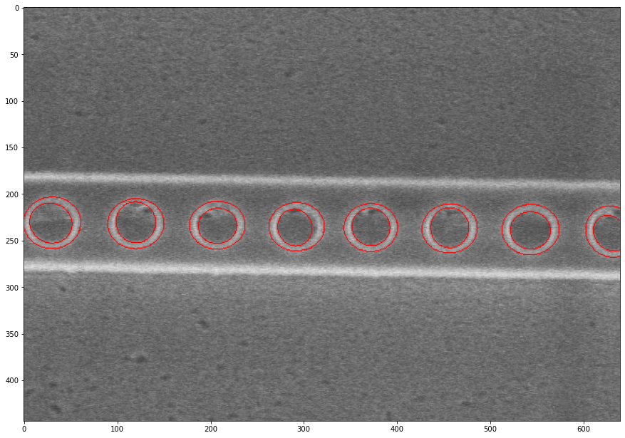
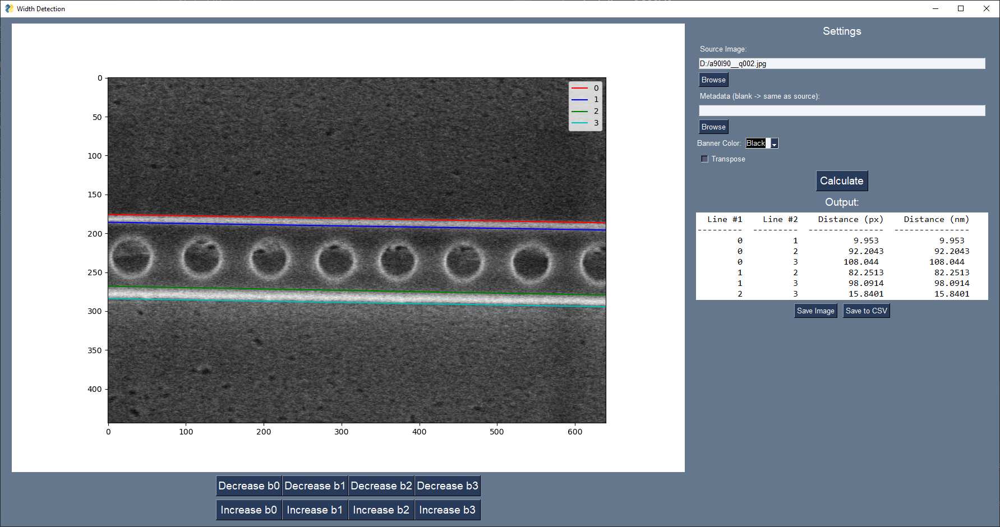

# SEM Feature Detection
Collection of work aiming to detect various features in SEM images of nanobeam photonic 
crystals, notable the hole sizes and beam width. This work was done in a summer research 
project from May 2022 to August 2022 under the supervision of Dr. Paul Barclay.

This will mainly be an archival tool of the progress I make on this. Commits will mainly
be various updates as I understand and discover different things. 

## Table of Contents
* [Goals](#goals)
* [Installation](#installation)
  * [Installing Python Packages](#installing-python-packages)
  * [Installing AAMED](#installing-aamed)
* [Usage](#usage)
  * [Ellipse Finder](#ellipse-finder)
  * [Width Finder](#width-finder)
* [Creating Ground Truth Images](#creating-ground-truth-images)
  * [ImageJ GT Steps](./ImageJ%20GT%20Steps.md)
* [Development](#future-development)
* [Wrap-Up](#wrap-up)

## Goals

The idea behind this project was to try and create a general purpose application
which can detect and extract various features of SEM images of nanobeams. In particular,
the sizes of the holes and width of the beam was of interest. To my knowledge, there
was not standardized open source methods to achieve this, so I wanted to make easily 
expandable and implementable code for others to use. 

## Installation

Installation is broken up into two section: the Python packages and the AAMED algorithm.
If the AAMED algorithm is not needed, one can skip installing it.

### Installing Python Packages

The Anaconda version of Python was used and tested in this work. Instruction for such 
will be given. If needed, first create a new environment with the desired Python 
version. Versions 3.8-3.10 have been tested.
```
conda create -n ellipse python=3.8
``` 
Next, install the required packages
```
conda install -n ellipse opencv=4.5.5 numpy pandas matplotlib tifffile ipykernel ipympl pysimplegui tabulate 
```
This assumes Jupyter Notebooks/Lab is already installed (which it is in the default
Anaconda setup).

OpenCV version 4.5.5 is specified since the provided AAMED binaries were compiled with
this version. Other mismatched versions may work, but to be sure, it is best to compile
the AAMED algorithm for that version if the functionality is desired. See the next 
section for details.

### Installing AAMED

[AAMED](https://github.com/Li-Zhaoxi/AAMED) (Arc Adjacency Matrix Based Fast Ellipse 
Detection) was a key algorithm used when trying to find more sophisticated ellipse 
finding algorithm. It gave a good point of comparison and for some images worked 
significantly better than brute force attempts.

In order to use the AAMED algorithm, the AAMED binaries should be downloaded and placed 
into the [`./ellipsefinder/methods`](./ellipsefinder/methods/) folder. The binaries are 
provided for AAMED in the releases section on the right side. Provided are versions for 
the Anaconda distribution of Python 3.8-3.10 for Windows and Linux compiled for OpenCV 
4.5.5. The system distribution in Linux should also work. For other distributions, one 
will need to build the AAMED binary themselves. 

Cython and a C++ compiler are needed for building. See the 
[AAMED GitHub page](https://github.com/Li-Zhaoxi/AAMED) for building details.

It is not necessary to install the AAMED binaries. If they are not found, an error will
be shown, but the code can be used normally without access to the AAMED algorithm.

## Usage

### Ellipse Finder

The main code is in [`./ellipsefinder`](./ellipsefinder/) and it consists of the main 
[`find_ellipses.py`](./ellipsefinder/find_ellipses.py) file and the 
[`methods`](./ellipsefinder/methods/) folder. In the 
[`find_ellipses.py`](./ellipsefinder/find_ellipses.py) file is all the functions 
wrapping the functionality of the various ellipse finding algorithms in the 
[`methods`](./ellipsefinder/methods/) folder.

Most of the testing of the algorithms I did with the Jupyter notebooks in 
[`./notebooks`](./notebooks/). It is a bit unorganized, but examples of using 
[`find_ellipses.py`](./ellipsefinder/find_ellipses.py) are best shown in
[`ellipses.ipynb`](./notebooks/ellipses.ipynb).

In general, a couple different sections should be written. First, for the images that
we have used, we open then and remove any banners that are present. Second, we set
up any filtering that we want done on the output results. Next, run our selected
detection algorithm in the standard way seen in the examples. Finally, we can calculate
some things with results and save all the output image.

Below is an example of the AAMED algorithm used on one of the nanobeams.



### Width Finder

For finding the widths, there are two related files. 
[`find_width.py`](./widthfinder/find_width.py) has the functions which are required for 
the algorithm. The main function goes through the required steps in order. For ease of 
use, [`find_width_sg.py`](./widthfinder/find_width_sg.py) attempts to wrap the 
functionality of in a [PySimpleGUI](https://github.com/PySimpleGUI/PySimpleGUI) GUI 
interface. Using this may be preferable, but it is still very much in an alpha state.
A screenshot of the interface is below.



The main procedure at the moment is as follows:
- Remove the banner from the image
- Preprocess and use OpenCV's HoughLinesP to obtain lines segments of the beam edges
- Categorize the lines by their slope and intercept
- Remove any obvious outliers via the interquartile range in the slopes
- Group and find the four main edges the define the beam via k-means where k=4
- Manually adjust the intercepts of the lines to better fit the beam

There are still many improvements to be made, in particular to the outlier removal,
manual adjustment of the lines, and grouping via k-means, but this algorithm tended 
to work well for "nice" images.

The main unsolved issue at the moment with the width finding algorithm is that it sorts 
lines by their slopes and intercepts. While this is usually fine, images whose nanobeam 
is vertically aligned cannot be categorized since these properties are undefined. For a 
simple fix, one can simply manually crop out the banner and rotate the image so the 
algorithm can proceed. Alternatively, in the GUI version, there is a transpose button 
that will transpose the image in the backend for use the algorithm. The resultant lines 
are then transposed back so they can be drawn correctly on the image. Since the only 
important point is the distance between the lines, transposes should not affect this in 
any way.

## Creating Ground Truth Images

To compare the accuracy of the ellipse finding methods, and for possible use in future 
machine learning methods, ground truth images/masks were created using 
[ImageJ](https://imagej.net/software/fiji/downloads). For the details in creating the
selection regions of interest (ROIs) and masks, see the 
[ImageJ GT Steps.md](./ImageJ%20GT%20Steps.md) file which goes through the steps.

Three files are created from this method: the ground truth mask, the ROI zip file, and 
the CSV file of the selection regions. I tested out both extraction the ellipses from 
the mask and creating the ellipse from the CSV selection region data. Both are okay, 
using [`./ellipsefinder/format_roi_csv.py`](./ellipsefinder/format_roi_csv.py) with the 
CSV data is probably better.

These images were mainly used as points of reference when testing the binarization 
methods for each algorithm, but they have great potential to be used as training data 
for ML models down the line.

## Future Development

### More Algorithms

I tried to make adding new future methods relatively easy. All the current ellipse
finder algorithms implement the abstract base class (ABC) 
[`finder.py`](./ellipsefinder/methods/finder.py) which has the various functions needed 
to get going. Bare minimum, the two abstract methods `preprocess()` and `extract()` 
should be implemented. `preprocess()`, if needed, should return a preprocessed image 
ready for the extraction process to start. `extract()` should actually implement the 
extraction process and return the DataFrame with the found ellipses' details. Is this 
the best way to organize this process? I don't know, but I thought it worked well for 
me.

The ABC also has a few convenience functions that can be utilized when creating a new
extraction method, as well as a default function to plot the found ellipses onto the
original image.

A standard that I have used when storing the data in the DataFrame is storing the angle
of the ellipse with the commonplace counterclockwise positive direction starting from
the x-axis. In the OpenCV methods I have used, it adapts a clockwise positive direction
starting from the x-axis as its standard. This is something to keep in mind when
creating the `extract()` function and storing results.

### Removing Banners

Removing the banners was an unexpected important step for the algorithms to succeed
more. Seen in [`rmbanner.py`](./ellipsefinder/preprocess/rmbanner.py), the current method
builds on [this one](https://github.com/lwang94/sem_size_analysis/blob/803251cdcab3d8304a365df9ac5879fcd9346270/experiments/3_Label_Data.ipynb)
adding a connected components analysis. At the moment, it is assumed that the banner
is at the bottom of the image and I simply crop the height of the largest connected
component off the bottom. For the data I had, this was sufficient but this may need
to change for banners in different locations.

### Adding Ellipse Finder to GUI

It was only near the end of the project before I got a chance to add a graphical 
interface to complement the code. The current width finder GUI is still quite buggy and 
there are likely many edge cases that have yet to be discovered. As well, the ellipse 
finder does not have a GUI yet and it would be good to incorporate this together with 
the width finder GUI. This would also allow the many options of each algorithm to be 
easily changed and dynamically updated. Similar to the structure of the ellipse finder, 
it may be good to have an abstract GUI to inherit from such that each algorithm can 
have its own set of options to adjust. This however, may also require programming in 
the edge cases for each state the GUI may be in which is often time-consuming as well.

### Width Finder Limitations

As mentioned in the [Width Finder](#width-finder) section, the main limitation for this
algorithm is the reliance on calculating the slope and y-intercept to remove outliers
and find the widths. Certainly other methods exist to solve this problem but I have not
had the time to explore all the different avenues here. Switching to line segments may
work better for distances, but then outlier detection becomes harder to manage.
Exploring different possibilities would be very interesting.

## Wrap-Up

This work so far is a great exploratory effort in creating a general purpose tool for
detecting and extracting features in SEM nanobeam images. An expandable methods for 
measuring hole diameters as well as a graphical interface for finding the width was
created here. Going forwards, adding more algorithms, refining the work, and unifying
both sections together in a collective GUI would allow for much better efficiency
and productivity.